# 1.0 Abstract
The purpose of this report is to confirm the results of "Using equivalence class counts for fast and accurate testing of differential transcript usage" by Cmero et al. [1]. The paper's main thesis is that equivalence class counts (ECCs) are good replacements for exon or transcript-based methods for differential transcipt usage (DTU) analysis. We check their results in two main ways: 1) by recreating the figures used in the paper via their provided Github repository [2], and; 2) by trying their proposed pipeline for DTU analysis via their published vignette [2]. We were able to successfully recreate some, but not all, of the figures in the paper, due to limitations in our available compute power. We were able to follow the pipeline manually to completion via the vignette [2], but were unable to run their pipeline provided as an alternative to the manual steps.

# 2.0 Background

Looking for differential transcript usage (DTU) between samples is the most important task when analyzing differential gene expression from RNA sequencing data. This was typically done directly using estimated transcript abundances or exon counts, where using transcripts is quite fast, but has limited accuracy compared to using exon counts which gives higher accuracy, but is computationally expensive and slow [1]. Given this, the authors suggest using equivalence class counts (ECCs) as an alternative method for performing DTU. 

The authors found that using ECCs directly for DTU was equally or more accurate than using exon counts, while being much faster. It is slower than using estimated transcript, but more accurate. The authors made a pipeline for performing DTU analysis. To confirm the authors' results, we ran their pipeline on their sample data, and also recreated the figures they used in their paper. In both cases, we followed Github repos prepared by the authors.

# 3.0 Methods
### 3.1 Reproduction of Paper Figures
Cmero et al. included a Github repository for replicating the figures created in their publication [2]. The repository contains data, helper scripts, and a .Rmd notebook which generates the paper figures from the data. We were able to successfully run the .Rmd notebook and recreate many of the figures in the paper. The paper's figures from three sources of data, from drosphila, humans (hsapiens), and mouse (Bottomly). We were particularly successful on the drosphila data, which is a toy data set and smaller than the other two. We had some challenges running the data on the larger data sets, we assume because our machine didn't have enough RAM - the machine used in the paper statedly had 256GB of RAM and an 8 core CPU [1, Table 1]. The .Rmd cached important data, so we were able to run it multiple times and complete it bit by bit, removing the larger data sets or skipping figures if necessary. The figures we produced are stored in this repo in ec-dtu-paper/figures-run#, where # is the number of the run during which the figure was generated. The figures we created are shown in the Results section.

### 3.2 Vignette Procedure

The authors also provided a vignette for running DTU analysis using ECCs [3]. This vignette uses a toy data set, which made it possible for us to replicate the results due to the compute requirements being much more manageable. The source code for the vignette is available here: https://github.com/Oshlack/ec-dtu-paper/wiki/Vignette. It provides guides on running the analysis using the authors' pipeline at https://github.com/Oshlack/ec-dtu-pipe, as well as doing it manually using Salmon or Kallisto. The main goal of replicating this vignette was for us to determine the reliableness and consistency of results from DTU analysis using ECCs.

The exact steps we took can be found in pipeline.ipynb available in our project repository: https://github.com/liamsquires/fall25-bioinformatics-project/blob/main/pipeline.ipynb. We didn't follow all the steps in the provided vignette, as we found that the authors' pipeline was buggy and was not compatible with our versions of DEXSeq and Salmon. We instead followed the steps associated with the manual setup using Salmon, as well as the DTU analysis using R.

### 3.3 Challenges

As mentioned in the Paper section, runtimes and compute power were limited for us compared to authors. As such, we often had to limit figure generation to the drosphila data. Note that this is because the ec-dtu-paper repo congregates and compare the different methods of gathering DTU data (via exons, ECCs, transcripts), compared to the vignette which focused only on equivalence class counts, which are less expensive to run. Another issue we faced with replicating the paper figures was that the repo used BiocLite to install dependencies, which is now obsolete and BiocManager has taken it's place. A similar challenge is that many packages required by the paper had in turn their own set of dependencies. These two challenges required much sleuthing before being able to run the code. The other issue was that the dependency dplyr had snce been updated, causing a bug in the original code. Newer dplyr (v1.1.4) preserves the data.table class through inner_join, whereas older versions converted it to a tibble/data.frame. A modification had to be made to the load_data.R helper function in the ec-dtu-paper repo.

Lastly, as mentioned in section 3.2 above, we faced a number of challenges when trying to run the authors' provided EC-DTU-pipe pipeline. Specifically, the run_dtu stage in their pipeline made some assumptions that didn't hold up in our environment: there were extra flags that we needed to explicitly default in our call parameters, and these flags were being inferred to the wrong type (booleans instead of strings) when defaulted. The EC matrix generation and interpretation also had bugs where the scripts that were interpreting the matrix assumed that certain column names and data were being included when they weren't being generated in the first place. Luckily, they also provided steps to do a manual setup using Salmon exclusively, which worked with little to no errors.

# 4.0 Results
### 4.1 Reproduction of Paper Figures
In total, we generated the following figures. Some figures are supplementary and not included in the paper directly.

*Figure2-1*. The original figure is included on the right. Note that the bottomly data is not included.

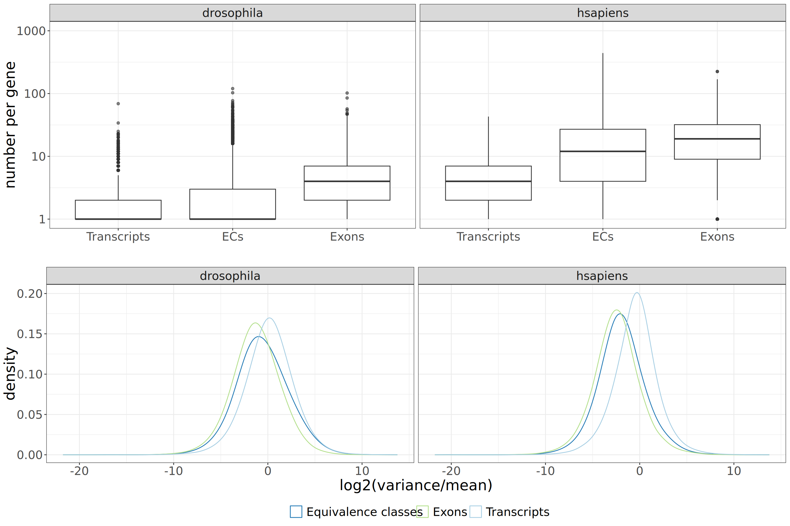 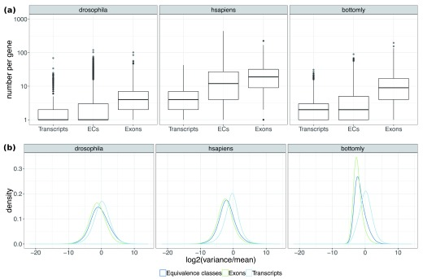

*SupplementaryFigure1-1*. This is only on the drosophila data.

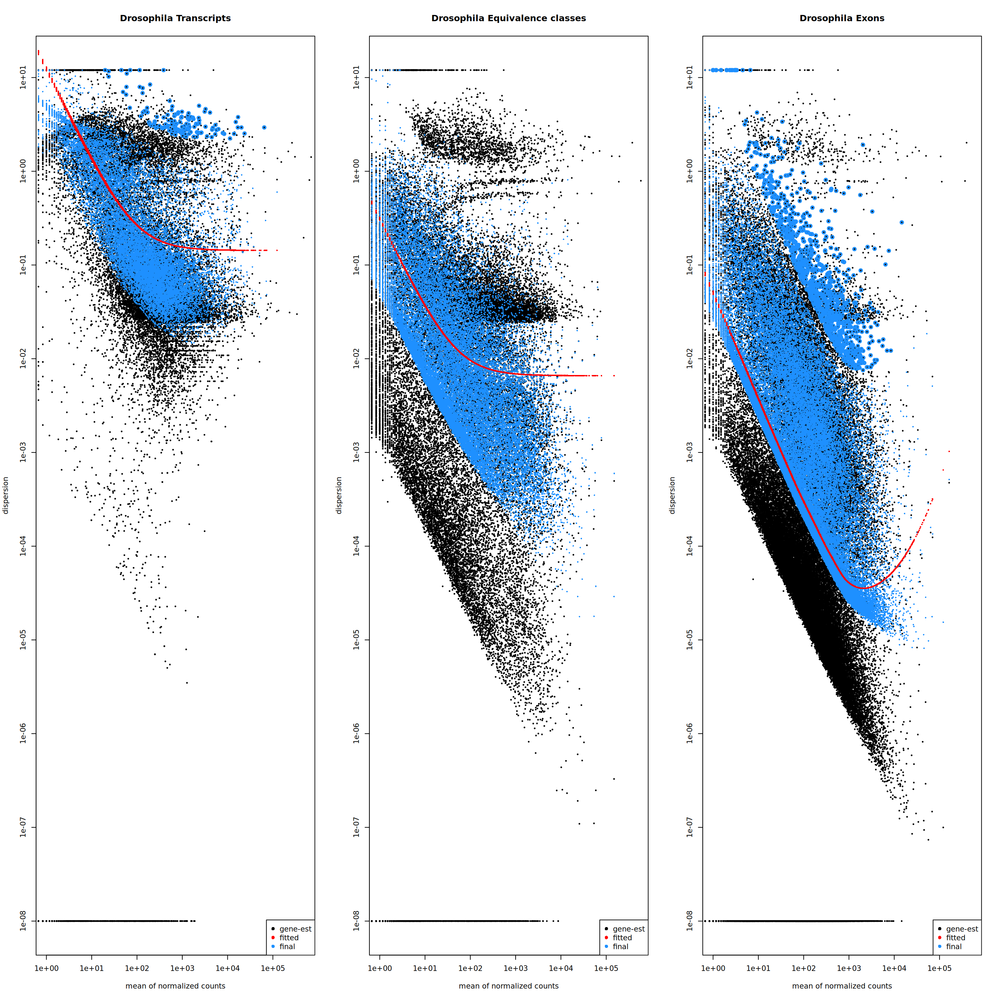 

*SupplementaryFigure6-1*. This is only on the drosophila data. This is a more detailed version of Figure 3a in the original paper, included on the right.

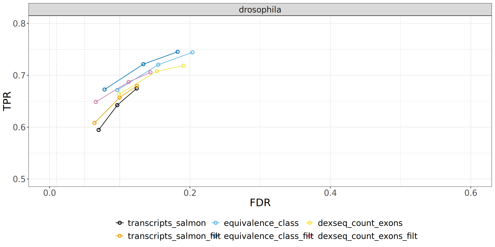 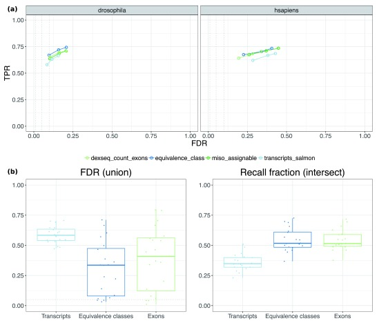

### 4.2 Vignette Results

The results from our vignette analysis can most easily be seen by comparing our generated figures with the examples provided in the vignette. In each of the following comparisons, our generated figure is shown above the corresponding reference plot. It should be noted that, as mentioned in section 3.3, we avoided using the authors' pipeline, and instead followed their manual instructions using exclusively Salmon, which, along with the nondeterministic nature of using ECs in DTU analysis, likely caused slight variations in our results.

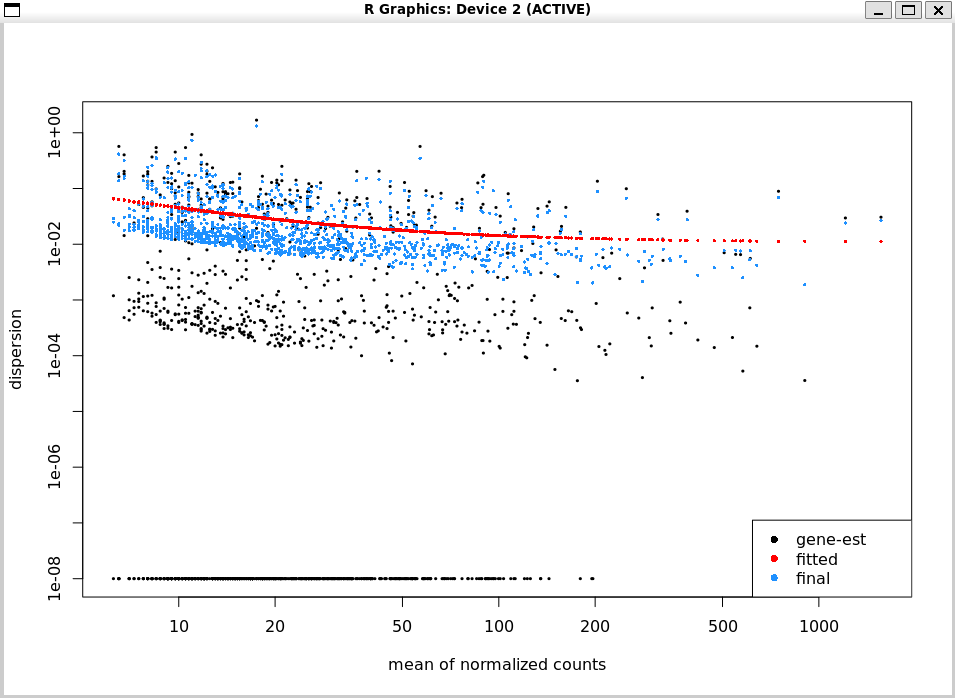  
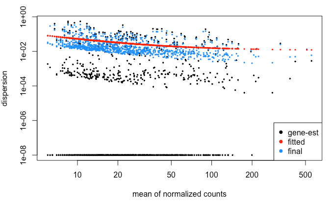  
The above plots show the EC data before and after adjusting for dispersion. In both, the dispersion trend is roughly the same, staying in between 1e-01 and 1e-02 for all normalized count means. The ECs themselves also show very similar distributions, both before and after shrinking using dispersion normalization. 

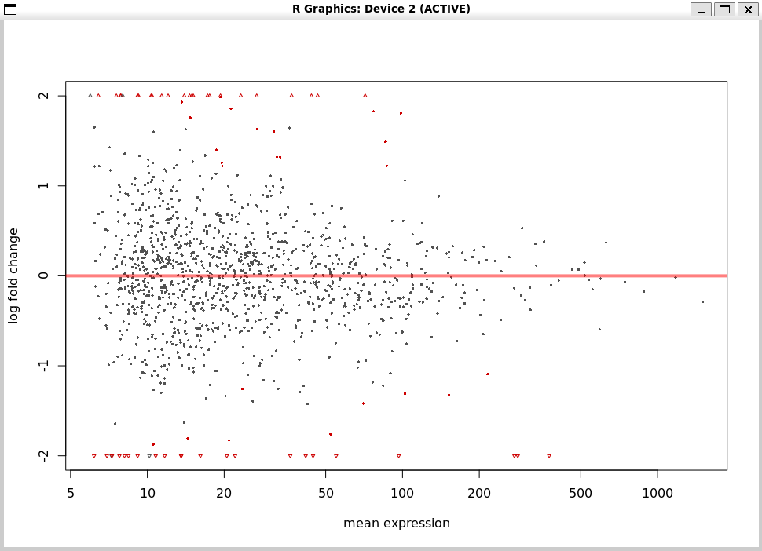  
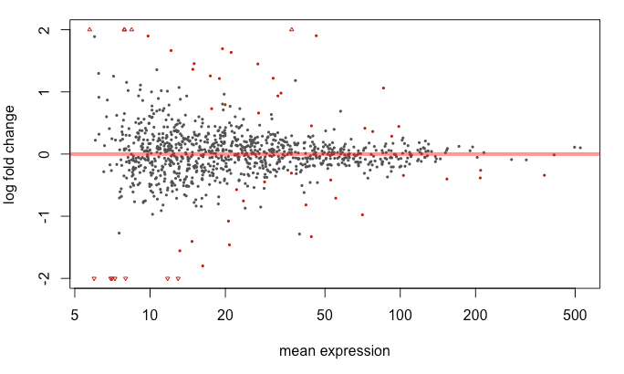  
This second set of plots highlight which ECs are significantly differentially expressed: the red dots and triangles highlight ECs that are separate enough to actually tell us something, after accounting for how often they appear. These plots also show very similar results, with ours having more usable ECs overall, with more non-differential (1181), and differential (59) ECs than the vignette examoples (974 and 47, respectively).

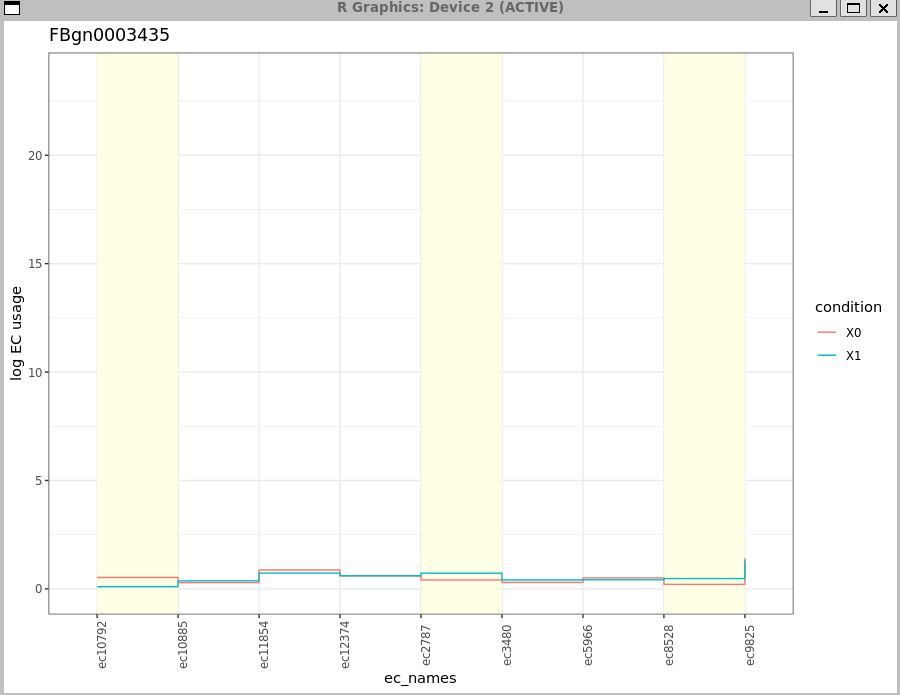  
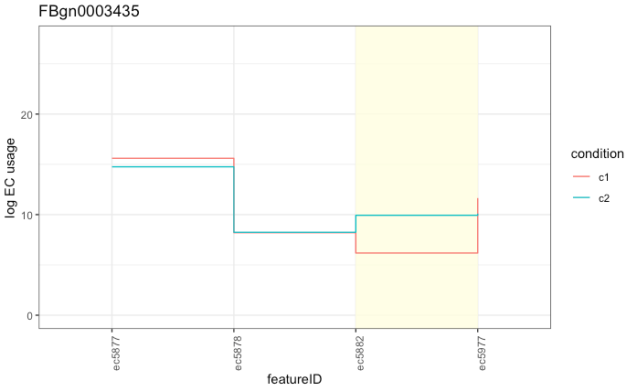  
This last set of plots allow us to visualize our DTU analysis by looking at differential EC usage within specific genes; the yellow shading indicates which ECs' p-values are below FDR, and therefore show significantly different usage between conditions. These plots are also distinctly different, with our generated plot showing 3 out of 7 significantly differential ECs compared to the example plot's 1 out of 4. 

# 5.0 Discussion
On the reproduction of the paper's figures, we were able to reproduce some, but not all of the figures. We were limited by compute power for this.

Our vignette results were largely comparable to the authors', but showed significantly different results. This is likely explained by one of two things: the provided EC-DTU-pipe steps differ from the manual Salmon procedure we used, or the changes we made to the plotting function and call for this table resulted in different results. Since we made only minor formatting changes for out plotting call, it seems most likely that the pipeline somehow differs from the manual Salmon procedure. It's worth noting that when running our procedure multiple times, we get consistent results each time, so this doesn't seem to be an inherent issue with EC-DTU analysis.

In conclusion, we were able to successfully replicate much of the work done in the paper, and our results reflect the findings of the original. We encountered some challenges which limited our reproductions, most notably a) being unable to run the provided pipeline in the vignette, instead doing the process manually, and; 2) being unable to replicate all figures from the paper on all data due to computational limitations.

In general, the original work was well documented and we're grateful for the precision with which they provided their methods and code. Although we encountered difficulties with outdated dependencies, by and large the process was smooth and well described by the orginal authors.

# 6.0 References
[1] M. Cmero, N. M. Davidson, and A. Oshlack, “Using equivalence class counts for fast and accurate testing of differential transcript usage,” F1000Research, vol. 8, p. 265, Apr. 2019. doi:10.12688/f1000research.18276.2  
[2] M. Cmero, “ec-dtu-paper,” Oshlack/ec-dtu-paper, https://github.com/Oshlack/ec-dtu-paper (accessed 2025).  
[3] M. Cmero, Vignette, https://github.com/Oshlack/ec-dtu-paper/wiki/Vignette (accessed 2025).  
